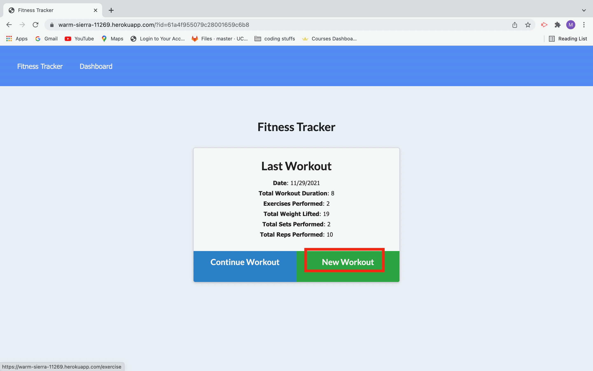
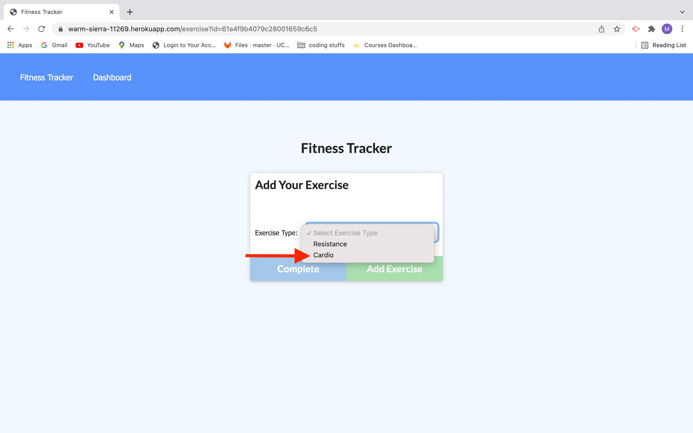
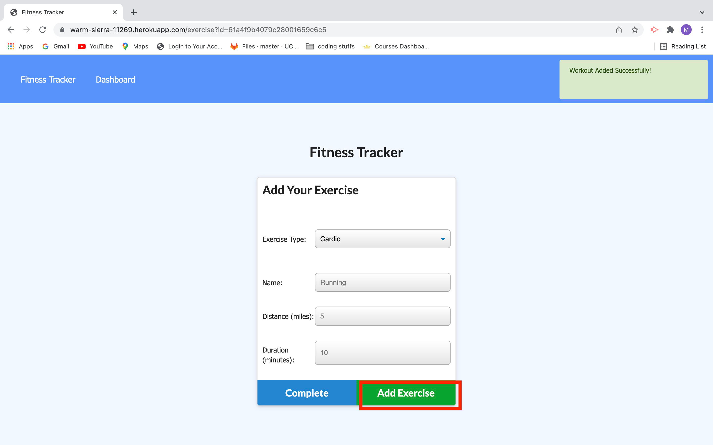
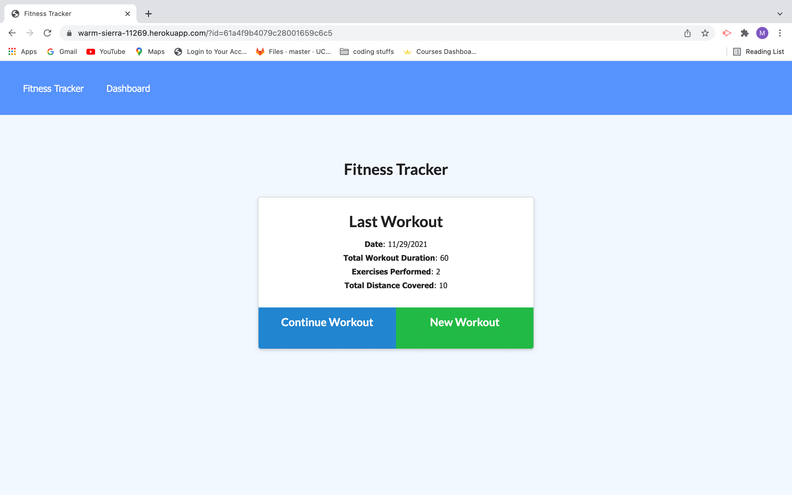
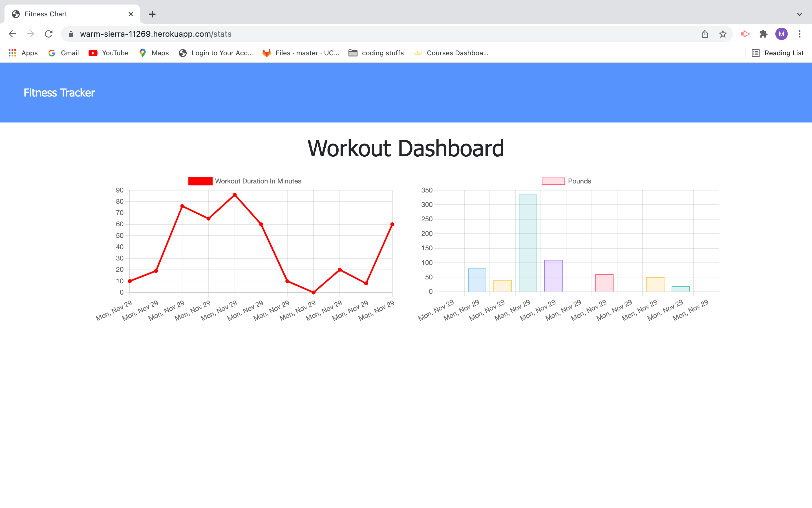

# Fitness_Tracker

##   

This app is a fitness tracker that allows users to view, create, and track daily workouts. It allows the user to log multiple exercises in a workout on a given day. It also tracks the name, type of exercise, weight, reps, sets, and duration of exercise. For cardio exercises the distance traveled is tracked. 

##   

Given front end starter code, we are tasked to create a database using MongoDB, create Mongoose schema, and handle routes with Express. 

##   

The user should be able to:   
1. add exercises to most recent workout plan  
2. add new exercises to a new workout plan
3. View combined weight of multiple exercises from the past seven workouts on "stats" page  
4. View total duration of each workout from the past seven workouts on the "stats" page

## 

  

GitHub Repo: https://github.com/MCassandra/Fitness_Tracker  

Live app: https://warm-sierra-11269.herokuapp.com/